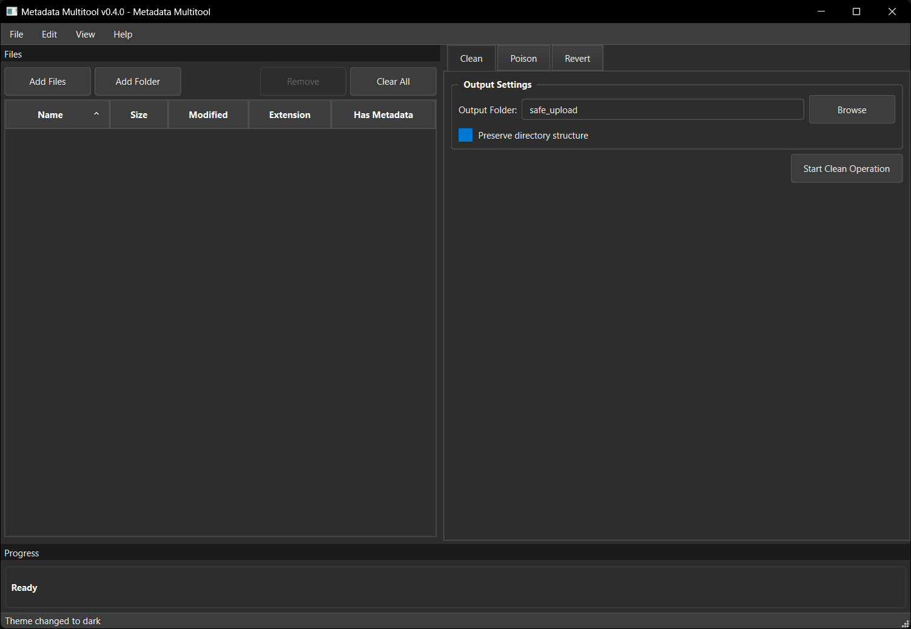

# Metadata Multitool

Local-first toolkit to **clean**, **manage**, and (optionally) **poison** image metadata to protect privacy and resist unauthorized AI training.

## Highlights
- ✅ **Clean to Safe Upload** — strip EXIF/IPTC/XMP; write clean copies to `./safe_upload/`.
- ✍️ **Edit/Preserve** — foundation for selective field edits (future UI).
- 🧪 **Optional Label Poisoning** — add misleading captions/sidecars, filename patterns, and HTML snippets to degrade scraped training labels. Off by default.
- ↩️ **Revert** — undo sidecars/fields/renames using a per-dir log.
- 🚀 **v0.4.0 New**: Professional PyQt6 GUI, batch processing, dry-run mode, advanced configuration

> **Ethics**: Mislabeling harms accessibility and may violate platform rules. Keep this optional. Prefer **Clean** for most users.

## Quickstart
```bash
python -m venv .venv
# Windows: .venv\Scripts\activate
source .venv/bin/activate
pip install -e .

# Optional but recommended for full metadata coverage:
# macOS: brew install exiftool
# Ubuntu/Debian: sudo apt-get install -y libimage-exiftool-perl
# Windows (choco): choco install exiftool

mm --help
mm gui  # Launch legacy Tkinter GUI
python src/metadata_multitool/gui_qt/main.py  # Launch modern PyQt6 GUI
mm clean ./samples
mm poison ./samples --preset label_flip --sidecar --json --xmp --iptc --exif --true-hint "cat on couch"
mm poison ./samples --preset clip_confuse --sidecar --rename-pattern "{stem}_toaster"
mm poison ./samples --preset label_flip --csv mapping.csv --html  # generate HTML snippet files
mm revert ./samples
```

## Commands
- `clean` — safe-copy images to `safe_upload` and strip metadata.
- `poison` — write misleading captions/keywords to EXIF/IPTC/XMP; create `.txt/.json` sidecars; optionally rename files and emit HTML snippets.
- `revert` — remove created sidecars, clear fields we wrote, and restore prior names when possible.
- `interactive` — guided workflow mode for step-by-step operations.
- `gui` — launch legacy Tkinter graphical user interface.

## v0.4.0 New Features

### 🎯 Professional PyQt6 GUI
- Modern desktop interface with native OS integration
- Light/dark themes with professional styling
- Real-time progress tracking with ETA display
- Comprehensive file management and operation panels


*Professional PyQt6 GUI with dark theme, file management, and operation panels*

### ⚡ Enhanced Performance
- **Batch Processing**: Parallel processing for large file sets (1000+ images)
- **Memory Management**: Configurable memory limits and usage monitoring
- **Progress Tracking**: Real-time ETA and performance metrics
- **Dry-Run Mode**: Preview operations before execution (`--dry-run`)

### 🔧 Advanced Configuration
- **YAML Config**: `.mm_config.yaml` for persistent settings
- **GUI Settings**: Theme, window size, and behavior preferences
- **Performance Tuning**: Batch size, worker count, memory limits
- **Auto-Discovery**: Config files found in directory hierarchy

### 🛠️ Improved Error Handling
- **Contextual Messages**: Detailed error descriptions with suggestions
- **Troubleshooting**: Actionable guidance for common issues
- **Validation**: Input validation with clear feedback

## GUI Interfaces

The Metadata Multitool includes both legacy and modern graphical interfaces:

### 🎯 Modern PyQt6 GUI (Recommended)
```bash
python src/metadata_multitool/gui_qt/main.py
```

**Features:**
- ✅ **Professional Interface**: Native appearance with modern styling
- ✅ **Light/Dark Themes**: Comprehensive theming with proper contrast
- ✅ **File Management**: Add files/folders with intuitive file panel
- ✅ **Operation Modes**: Dedicated panels for Clean, Poison, and Revert
- ✅ **Real-time Progress**: Background operations with progress tracking
- ✅ **Settings Management**: Full configuration through settings dialog
- ✅ **Fixed Layout**: Professional layout with non-movable panels
- ✅ **CLI Integration**: Full backend compatibility with existing CLI tools

### Legacy Tkinter GUI
```bash
mm gui
```

**Features:**
- **Mode Selection**: Basic switching between Clean, Poison, and Revert modes
- **File Management**: Simple browse files/folders functionality
- **Progress Tracking**: Basic progress bars and status updates
- **Settings Panel**: Configure tool settings through the GUI

### Installation Requirements
```bash
# For PyQt6 GUI (modern interface)
pip install PyQt6

# For Tkinter GUI (legacy - usually included with Python)
# No additional installation required
```

See `GUI_README.md` for detailed GUI documentation.

Docs: see `DESIGN.md`, `docs/POISONING.md`, `docs/ETHICS.md`, `docs/CI.md`, `CONTRIBUTING.md`.